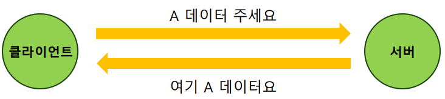
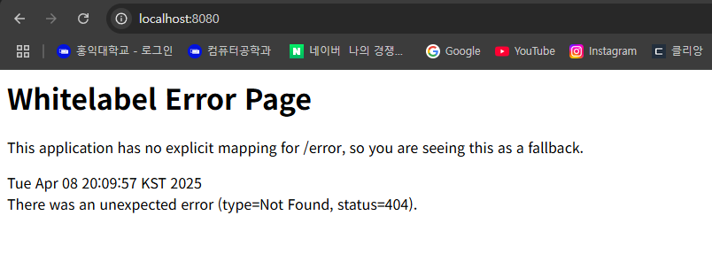

# week1

# 웹

- 여러 컴퓨터가 서로 연결되어 정보를 공유하는 공간
- 컴퓨터가 서로 정보를 주고 받는 일반적인 형태는 클라이언트-서버 패러다임
    - 클라이언트: 데이터의 생성/조회/수정/삭제 요청을 전송
    - 서버: 요청대로 동작을 수행하고 응답을 전송
    
    
    

# 프로토콜과 HTTP

## 프로토콜

- 네트워크 안에서 요청과 응답을 보내는 규칙
- 웹에서는 HTTP 라는 프로토콜(규칙)을 사용

- HTTP를 통해 요청을 보낼 땐 HTTP Method, URL이 필요
    - HTTP Method: 데이터를 다루는 방법
        - GET: 데이터를 가져온다. (조회)
        - POST: 데이터를 게시한다. (생성)
        - PUT: 데이터를 교체한다. (수정)
        - PATCH: 데이터를 수정한다. (수정)
        - DELETE: 데이터를 삭제한다. (삭제)
    - URL:   다룰 데이터의 위치
        - Path Parameter
        
        
        
        - Query String
        
        
        

## HTTP 데이터의 구조

- HTTP 헤더
    - 통신에 대한 정보
    - ex. 언제 보냈는지, 누가 보내는지, HTTP method 종류, 요청 경로 등
- HTTP 바디
    - 주고 받으려는 데이터(보통 json 형식)

- 응답을 보낼 땐 요청에 대한 처리 결과를 나타내는 상태 코드를 함께 응답
    - 상태 코드는 응답 데이터의 HTTP 헤더에 들어간다.
    - 대표적인 상태 코드
        - 200 → 처리 성공 (ok)
        - 201 → 데이터 생성 성공 (created)
        - 400 → 클라이언트 요청 오류 (bad request)
        - 404 → 요청 데이터 없음 (not found)
        - 500 → 서버 에러 (internal server error)

# 프론트엔드와 백엔드

## 프론트엔드

- 화면에 채울 컨텐츠 데이터를 백엔드에게 요청

## 백엔드

- DB에서 가져온 컨텐츠 데이터를 프론트에게 응답

# API

- Application Programming Interface
- 어플리케이션과 소통하는 방법(창구)을 정의한 것

## 백엔드 API

- 어떤 HTTP method, url을 사용해야 하는지 정의한 것
- 각 요청에 대해 어떤 응답을 보내는지 정의한 것

## REST API

- REST 아키텍처를 따르도록 설계한 API

# 에러화면 캡쳐

[todomate API 명세서](todomate%20API%20%E1%84%86%E1%85%A7%E1%86%BC%E1%84%89%E1%85%A6%E1%84%89%E1%85%A5%201cfebdffc4068026b6abf9e2f3e7e0ad.csv)