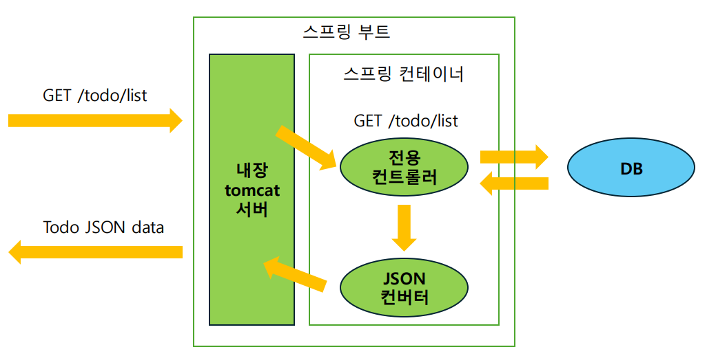

# week2

# 1. 스프링 빈과 스프링 컨테이너

## 1.1 스프링

- JAVA 진영의 대표적인 백엔드 프레임워크
- 객체지향 원칙을 지키면서 개발할 수 있도록 도와줌

### 스프링 부트

- 스프링 프레임워크를 사용하여 개발할 때, 편의를 더해주는 도구
- 스프링으로 개발할 때는 스프링 부트를 함께 사용

## 1.2 스프링 빈

- 어플리케이션 전역에서 사용할 공용 객체
- 스프링 컨테이너라고 하는 공용 창고에 빈(객체)을 저장
- 필요한 빈을 스프링 프레임워크가 자동으로 컨테이너에서 받아 사용
- 빈을 요구하는 객체도 스프링 빈이어야 함
    
    => 빈을 사용하는 주체 역시 스프링 빈이므로 서로가 서로를 필요로 하는 구조로 되어있다.
    

## 1.3 스프링 컨테이너

- 스프링 빈이 저장되는 공간
- 어플리케이션 컨텍스트(Application Context) 라고도 한다.

# 2. 스프링 컨테이너에 빈 저장

## 2.1 설정 파일 작성(수동 등록)

- 자바 클래스로 작성
- 클래스에 @Configuration 으로 설정 파일임을 명시
- 메서드에 @Bean 어노테이션 사용하고, 그 안에 빈으로 등록할 객체를 생성.

### 테스트

- ApplicationContext 으로 컨테이너 생성
    - @Configuration 으로 등록한 스프링 컨테이너를 따로 만든다.
- 스프링 빈은 기본적으로 1개의 객체
    
    ⇒ 컨테이너에서 빈을 가져올 때마다 같은 객체가 반환
    

## 2.2 컴포넌트 스캔(자동 등록)

- 빈을 생성할 클래스에 @Component 어노테이션 사용
- 어플리케이션을 시작할 때 @Component가 붙은 클래스를 찾아서 자동으로 빈 등록

### 테스트

- @Configuration 으로 등록한 설정 파일에 @ComponentScan 어노테이션 사용
- 스캔해서 발견한 컴포넌트를 빈으로 등록

※ @SpringBootApplication 어노테이션 안에 @ComponentScan이 내장되어 있어 따로 설정 파일을 만들고 할 필요가 업다.

※ 우리는 빈을 생성할 클래스에 @Component를 붙이면 끝

# 3. 스프링 컨테이너에서 빈 받아오기

## 3.1 의존성 주입 (Dependency Injection, DI)

- 내가 의존하는 객체를 직접 생성하지 않고 밖에서 주입 받는 것
- 컨테이너에 저장된 빈(객체)과 빈(객체)사이의 의존성을 프레임워크가 주입하는 것
- 컨테이너에 직접 접근해서 빈을 꺼내지 않고, 프레임워크에게 필요한 빈(의존성)을 요청하고 받아서 사용
- 빈이 아닌 객체에 빈을 자동으로 주입할 수는 없다.

### 의존성을 주입 받는 이유

- OCP(Open Close Principle) 원칙을 준수
    
    필요한 객체를 내가 하드코딩하지 않기 때문에 유지보수하기 좋아진다
    
- 메모리를 효율적으로 사용
    
    매번 필요한 객체를 생성하는 대신, 생성해둔 객체를 사용해서
    

## 3.2 의존성 주입 방법

- 어떤 객체에 다른 객체를 주입해 달라고 표시해두면(@Autowired) 프레임워크가 알아서 객체를 주입

### 생성자 주입

- 의존성이 바뀔 일이 없는 경우 안전하게 final로 선언
- 생성자에 @Autowired 을 사용하여, 생성자를 통해 빈을 주입
    - 만약 생성자가 하나만 있다면, @Autowired를 생략 가능
- @RequiredArgsConstructor를 사용하면 모든 final 필드에 대한 생성자를 자동으로 만들어주어 생성자 코드까지 생략 가능

### 필드 주입

- 필드에 바로 @Autowired 어노테이션을 사용(final은 사용 불가)
- 주로 테스트 코드에서 사용
    - 운영 코드에서 사용하면 IDE에서 경고를 띄운다.
- 테스트:
    - 테스트 클래스에 @SpringBootTest 를 사용하면 모든 빈을 컨테이너에 등록한 후 테스트한다.
    - 스프링 부트까지 실행시키므로, 통합 테스트에도 사용할 수 있다.

### 메서드 주입

# 4. 스프링 Layered Architecture

## 4.1 컨트롤러

- 클라이언트의 요청을 받고, 응답을 보내는 계층
- DTO (Data Transfer Object)를 사용하여 서비스 계층과 데이터를 주고받는다.

## 4.2 서비스

- 어플리케이션의 비즈니스 로직이 담기는 계층
- 레포지토리 계층과 소통하며 엔티티, 또는 DTO로 소통한다.

## 4.3 레포지토리

- DB와 소통하며 데이터를 조작하는 계층
- 서비스 계층이 결정한 비즈니스 로직을 실제 DB에 적용

## 4.4 스프링 빈 활용

- 컨트롤러, 서비스, 레포지토리는 스프링 빈으로 등록한다.
    
    ⇒ 매번 새로운 객체를 생성할 필요가 없고, 객체지향 원칙을 준수하며 의존성을 관리할 수 있기 때문
    

