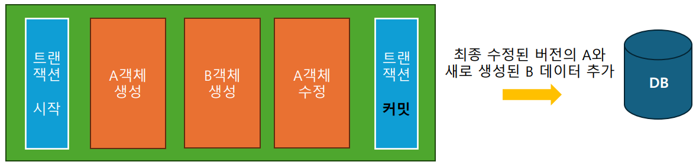

# week4

복습 완료: No

# 1. 레포지토리 계층

- DB와 소통하며 데이터를 조작하는 계층
- 서비스 계층이 결정한 비즈니스 로직을 실제 DB에 적용
- 데이터 조작 4가지 기능(CRUD)
    - 생성 (Create)
    - 조회 (Read)
    - 수정 (Update)
    - 삭제 (Delete)
    
    ⇒ CRUD 기능은 JPA가 제공하는 기능을 이용하여 구현
    
- 레포지토리는 빈으로 등록하여 사용
    - `@Repository` 어노테이션을 사용
        - 내부적으로 `@Component` 어노테이션이 적용되어 컴포넌트 스캔 시 빈으로 등록

# 2. 엔티티 매니저

- JPA는 `application.yml` 정보를 통해 Entity Manager를 생성
- 우리 대신 DB와 직접 소통하는 객체
    - 새로 생성한 엔티티 객체를 DB에 추가
    - DB에서 조회한 데이터로 엔티티 객체 만들기
    - 엔티티 객체에 대한 수정, 삭제를 DB에 반영

# 3. 트랜잭션

- 데이터 조작하는 행위들에 대한 쪼갤 수 없는 큰 동작 단위. (`@Transactional`)
- JPA는 DB와 유사하게 트랜잭션 단위로 동작
- 트랜잭션이 끝나면 모든 변경사항을 DB에 반영

- 트랜잭션 중간에 에러가 발생하면 트랜잭션 범위 안의 모든 변경점을 되돌린다. (롤백)

# 4. 영속성 컨텍스트

- DB에서 조회한 엔티티를 캐싱하는 공간
- JPA가 DB에 반영할, 엔티티의 모든 변경 사항을 보관하는 공간
- 영속성 컨텍스트를 기반으로 한번에 SQL을 생성
    1. 엔티티에 대한 변경 사항을 영속성 컨텍스트에 저장
    2. 트랜잭션을 커밋
    3. 저장된 모든 변경점이 DB에 반영

## 엔티티 저장

- `em.persist()`:
    - 영속성 컨텍스트에 엔티티 추가
    - 트랜잭션 커밋 또는 flush 호출(`em.flush()`)시 DB에도 데이터를 추가 (DB를 영속성 컨텍스트와 동기화)

## 엔티티 조회

- `em.find()`:
    - 영속성 컨텍스트에서 데이터 조회
    - 영속성 컨텍스트에 데이터가 없다면 DB에서 읽어온다.
    - 두번째 조회시에는 DB에 쿼리를 보내지 않고 영속성 컨텍스트에서 가져온다. (1차 캐시, 동일 객체 보장)
- `em.createQuery()`:
    - 직접 쿼리를 작성하여 조회
    - JPA에서는 DB에서 사용하는 SQL 대신, 객체에 대한 쿼리인 JPQL을 사용
    
    
    
    ex. 특정 유저의 할일 리스트 조회
    

### SQL vs. JPQL

- SQL:
    
    select *
    
    from todo ← todo는 테이블
    
    select *
    
    from todo as t
    
    where t.user_id
    
    = @user_id
    

- JPQL:
    
    select t
    
    from Todo as t ← Todo는 엔티티
    
    select t
    
    from Todo as t
    
    where t.user = :user
    

## 엔티티 수정

- 조회하고 트랜잭션 안에서 컨텍스트에 있는 객체를 수정 시, 트랜잭션이 끝날 때 엔티티 매니저가 수정된 정보와 최초 상태를 비교해서 SQL 생성 (변경 감지)

## 엔티티 삭제

- `em.remove()`:
    - 조회하고 트랜잭션 안에서 컨텍스트에 있는 객체를 삭제 시, 트랜잭션이 끝날 때 엔티티를 삭제 상태로 만든다.