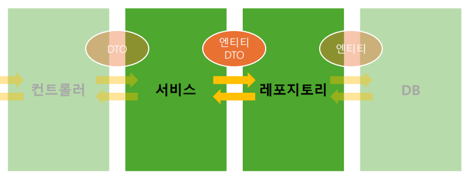

# week5

유형: 스터디
자료: %EB%B0%B1%EC%97%94%EB%93%9C_%EC%A0%95%EA%B7%9C_%EC%8A%A4%ED%84%B0%EB%94%94_5%EC%A3%BC%EC%B0%A8.pdf
복습 완료: No

# 1. 서비스 계층



- 어플리케이션의 비즈니스 로직이 담기는 계층
- 레포지토리 계층과 소통하며 엔티티, 또는 DTO로 소통

---

### 비즈니스 로직 예시

1. A 데이터를 생성한다.
2. B 데이터를 생성한다.
3. A, B 데이터를 이용하여 C 데이터를 생성한다.
    
    Q) B 데이터를 만들다가 에러 발생 → 1번 과정에서 이미 생성된 A 데이터는 어떻게 해야 할까?
    
    A)세 로직은 셋 다 실행되거나, 셋 다 실행되지 않아야 한다.<원자성을 가진 로직>
    

---

- 서비스 계층의 하나의 메서드에는 원자성을 갖는 로직을 기술
- 서비스 계층에 메서드 단위로 트랜잭션을 적용하기 위해 메서드에 `@Transactional` 을 붙여준다. (원자성 보장)
    - 중간에 에러가 발생하면 변경 사항을 롤백
- 서비스도 객체를 중복해서 생성할 필요가 없어 `@Service` 어노테이션을 이용하여 빈으로 등록
- 서비스 계층은 레포지토리 계층에 의존 →  생성자 주입방식으로 의존성을 주입

---

## 1. 1 할 일 생성

### 리팩토링

### 예외 처리

- 만약 id 값이 존재하지 않으면, findById()의 반환 값은 null
    
    →user 값이 null 이라면 예외를 발생
    
    ```java
    User user = userRepository.findById(usrId);
    
    if (user == null) {
    	throw new Exception("");
    }
    ```
    

+) `@Transactional(readOnly = true)`: 조회만 하는 경우, 트랜잭션 내에서 데이터가 변경되지 않도록 readOnly 속성을 활성화

# 2. 컨트롤러 계층


- 클라이언트의 요청을 받고, 응답을 보내는 계층
- DTO (Data Transfer Object)를 사용하여 서비스 계층과 데이터를 주고받는다.
- 컨트롤러도 하나의 객체만 생성하면 되므로 빈으로 등록
- `@Controller`를 사용하면 컴포넌트 스캔의 대상

---

### 프로토콜과 HTTP - 복습

- 보통 어플리케이션과 관련된 데이터는 body에 담는다(header에 담는 경우도 존재)
- HTTP 요청으로 보내는 데이터 → Request Body
- HTTP 응답으로 보내는 데이터 → Response Body

---

- API 서버는 json 데이터를 응답하는 경우가 많다
    - `@ResponseBody` 사용 → 객체를 json 데이터로 변환해 response body에 담아 응답한다.
    - 편의를 위해 `@RestController`(`@Controller + @ResponseBody`)을 대신 사용
- 컨트롤러 계층은 서비스 계층에 의존
    - 생성자 주입 방식으로 서비스 빈을 주입
- `@RequestMapping`을 이용 메서드가 처리할 요청 method, url을 지정
    - URL 앞 공통 URL은 클래스에서 지정
    - URL 뒤 상세 URL은 메서드에서 지정 (뒷 부분이 없다면 생략 가능)
- 편의를 위해 요청 Method 종류는 어노테이션으로 지정
    - Post ⇒ `@PostMapping`
    - Get ⇒ `@GetMapping`
    - Delete ⇒ `@DeleteMapping`
    - Patch ⇒ `@PatchMapping`
- Request body 데이터는 보통 json 형식, 메서드 파라미터로 받을 수 있음
    - `@RequestBody`를 사용하여 파라미터로 들어오는 json 데이터를 자바 객체로 변환하여 받을 수 있음.
    - 데이터를 받는 자바 객체를 DTO(Data Transfer Object)

---

## 응답 생성

- 클라이언트의 요청을 처리한 뒤, 처리 결과를 상태코드를 사용하여 클라이언트에게 알려주어야 한다.
- 대표적인 상태 코드:
    - 200 → 처리 성공 (ok)
    - 201 → 데이터 생성 성공 (created)
    - 400 → 클라이언트 요청 오류 (bad request)
    - 404 → 요청 데이터 없음 (not found)
    - 500 → 서버 에러 (internal server error)
- 스프링이 제공하는 `ResponseEntity`를 통해 http 응답을 만들어서 반환
    - 제네릭 타입은 Response Body로 반환할 객체의 타입을 지정
    - Response Body가 없으므로 Void를 지정
    - Response에도 DTO를 사용하는 것이 일반적

### 생성

- 생성 성공 시, 보통 201 과 생성된 데이터의 위치(path)를 함께 응답
    - 생성된 데이터의 위치는 /todo/{todo_id} 형태로 나타낼 수 있다
    - Service 에서 생성된 todo 엔티티의 id를 받아오자.

### 조회

- 조회 성공 시, 보통 200 OK 상태코드를 응답
    
    +) 유저 정보는 body에 직접 넣지 않음! Spring Security와 세션, JWT를 공부해보기
    

### 삭제

- Path variable은 url에 {변수명} 형태로 명시
    - `@PathVariable`을 사용해 path parameter 값을 매개변수로 받을 수 있다.
    - 삭제 성공 시, 보통 204 no content 상태코드를 응답

### 수정

- 수정은 @RequestBody, @PathVariable 을 모두 사용
    - 수정 할 content ⇒ request body
    - 수정 할 객체 ⇒ path variable