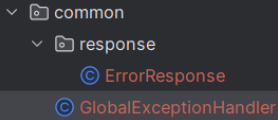

# week6

자료: %EB%B0%B1%EC%97%94%EB%93%9C_%EC%A0%95%EA%B7%9C_%EC%8A%A4%ED%84%B0%EB%94%94_6%EC%A3%BC%EC%B0%A8.pdf
복습 완료: No

# 1. 유효성 검사

- 요청으로 들어오는 데이터가 올바른 형식인지 검사하는 것
- 데이터를 받아들이는 DTO에서 유효성을 검사(‘형식’ 만 검사)
- 유효성 검사를 도와줄 외부 의존성을 추가
    - implementation 'org.springframework.boot:spring-boot-starter-validation’
- DTO 클래스에 제약 사항과 에러 메시지를 명시
    - `@Min`
    - `@Max`
    - `@NotNull`
    - `@NotBlank`
    - `@Email`
    - `@Size`
- 컨트롤러 메서드의 매개변수로 `@Valid` 를 사용하여 명시된 제약 조건에 맞는지 검사

### if) 100보다 긴 문자열이 요청으로 들어온다면?

- DB에 데이터를 넣을 때 에러가 발생
    - 우리의 서비스의 정책을 위반하지는 않지만 클라이언트는 무엇이 문제인지 알 수 없다
- DB까지 요청을 보내서 예외를 확인하므로 시간, 자원의 낭비가 발생

# 2. 예외 처리

- 에러가 발생했을 때, 원인을 알려주는 에러 메시지를 담도록 직접 응답 객체를 만들어서 전송

## Global Exception Handler

- 스프링에서 제공.
- 예외 종류에 따라 응답할 response를 설정
- 전역에서 발생하는 모든 에러에 대해 어떻게 처리할 지 결정

- 공통으로 사용하므로 common 패키지 밑에, GlobalExceptionHandler 를 생성
- 에러 정보를 반환할 DTO도 response 패키지 밑에 생성
- ErrorResponse 클래스

- Message에 더해 에러코드를 정의하여 함께 보낼 수 있다
- GlobalExceptionHandler 클래스

- `@ExceptionHandler(Exception.class)`
    - Exception 타입의 에러가 발생하면 handleUnknownError 메서드가 대신 response를 만들어서 응답
    - 에러 클래스를 매칭할 때는, 상속관계를 따라 올라가며 매칭
    - Exception 클래스는 모든 에러 클래스의 공통 부모
    - Exception 클래스에 대한 핸들러를 작성하면 특정 핸들러로 처리하지 못한 에러는 이 핸들러가 처리
- `@ControllerAdvice`
    - 모든 컨트롤러의 공통 관심사(에러처리)를 별도의 클래스로 분리하여 구현

+)`@Transactional`도 모든 서비스 메서드의 공통 관심사(트랜잭션)를 미리 구현된 별도의 클래스가 대신 처리하도록 구현

## 커스텀 예외 처리

- 공통으로 사용할 예외이므로 common 패키지 밑에 exception 패키지를 만든다
- BadRequestException 클래스

- 실행 중 발생하는 예외이므로 `RuntimeException` 을 구현
- GlobalExceptionHandler 클래스

# 3. 예외 메세지 클래스

- 예외 메세지를 상수로 정의한 클래스
- ErrorMessage 클래스

- 서비스 클래스

- 서비스에 작성한 에러 메세지를 상수로 변경
- DTO 클래스

- DTO에 작성한 에러 메세지도 상수로 적용

# 4. API 문서화

- 백엔드가 만든 API에 대한 사용법을 문서로 공유
- 프론트엔드와 협업할 때 API 문서를 공유

## API 문서화 과정

1. spring doc을 이용해서 OpenAPI 규격으로 API 문서 생성
2. Swagger-ui를 사용하여 spring doc이 생성한 API 문서에 swagger 디자인 적용
- Spring doc 의존성을 추가
    - implementation ‘org.springdoc:springdoc-openapi-starter-webmvc-ui:2.6.0’
    - spring doc은 swagger-ui를 적용한 문서를 만들어준다
    - `@ApiResponse`를 사용하여 status code마다 설명을 적을 수 있다
    
    